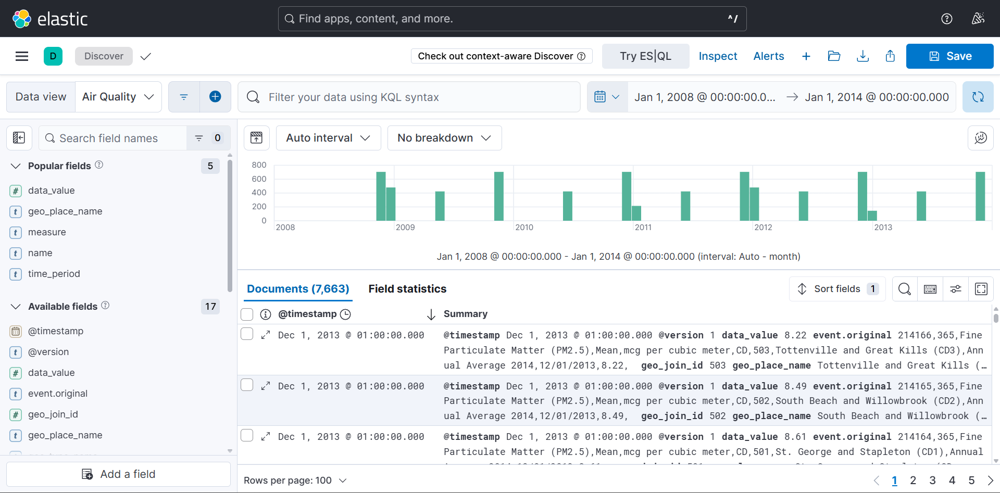
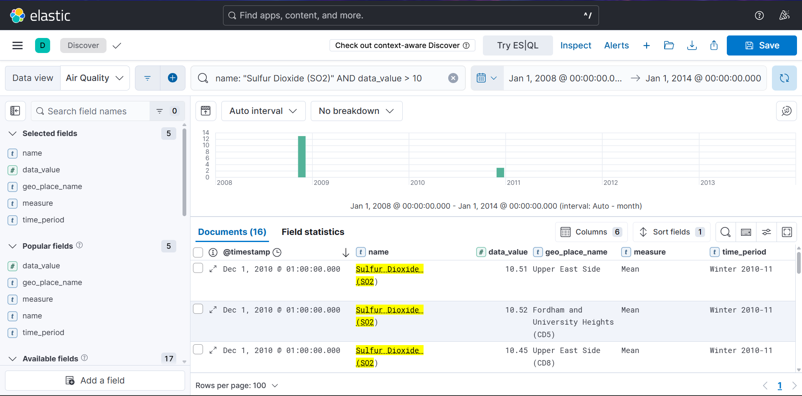
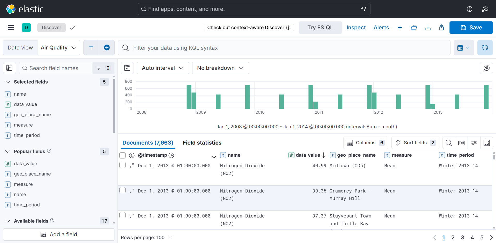
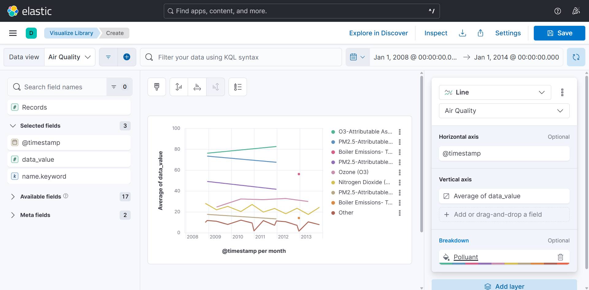
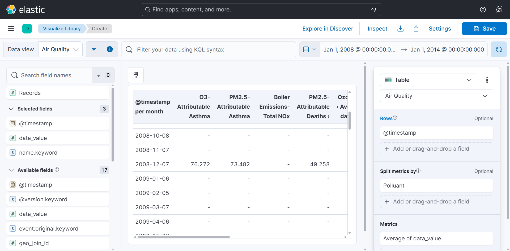
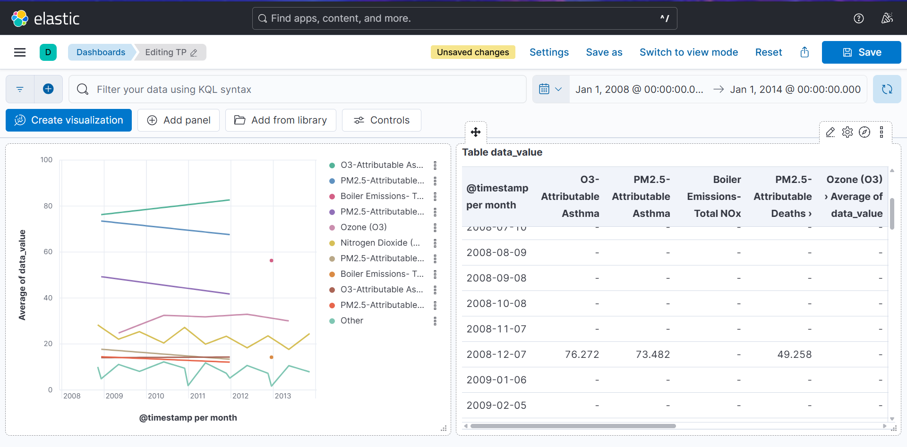
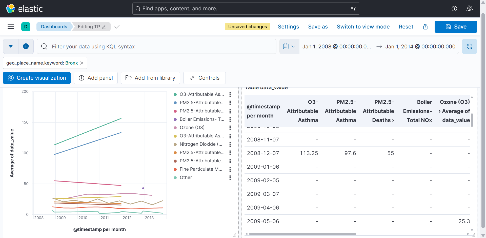

# TP Observabilité - ELK Stack

> Célian CHAUSSON

Ce projet implémente une chaîne complète d'observabilité des logs (déploiement, collecte, filtrage, indexation, recherche et visualisation) pour une application HTTP de type microservice dans un cluster Kubernetes (`kind`), sans utiliser Helm ou d'opérateur complexe.

---

## Déploiement

```bash
# Créer le cluster Kind (l'image est spécifiée pour que je puisse run sur mon Windows)
kind create cluster --name tp-elk --image kindest/node:v1.31.2 --config kind-config.yaml

# Construire l'image de l'application et de l'importateur Air Quality
docker build -t elk-demo-app:v1.0.0 app
docker build -t air-quality-importer:v1.0.0 -f air-quality-importer/Dockerfile .

# Charger les images dans le cluster Kind
kind load docker-image elk-demo-app:v1.0.0 --name tp-elk
kind load docker-image air-quality-importer:v1.0.0 --name tp-elk

# Appliquer les manifestes
kubectl apply -f manifests/
```

Vérifier l'état des pods en tant réel :

```bash
kubectl get pods -n elk -w
```

---

## Organisation des manifests (`manifests/`)

Chaque fichier porte une responsabilité claire, assurant une architecture modulaire et facile à tester :

- **`00-namespaces.yaml`** : Crée le namespace unique `elk` qui regroupe tous les composants de l'infrastructure d'observabilité et l'application cliente.
- **`01-elasticsearch.yaml`** : Déploie l'image officielle `docker.elastic.co/elasticsearch/elasticsearch:8.19.16` en mode single-node, avec les limites de ressources configurées et la sécurité désactivée pour faciliter le développement.
- **`02-kibana.yaml`** : Déploie l'image `docker.elastic.co/kibana/kibana:8.19.16` configurée pour se connecter au service Elasticsearch.
- **`03-logstash.yaml`** : Configure la ConfigMap de pipeline, déploie l'image `docker.elastic.co/logstash/logstash:8.19.16` et expose le port 5044 pour recevoir les logs provenant de Filebeat.
- **`04-filebeat.yaml`** : Déploie un `DaemonSet` (`docker.elastic.co/beats/filebeat:8.19.16`) qui s'exécute sur chaque nœud pour récolter les fichiers logs des conteneurs depuis le chemin `/var/log/containers` et les acheminer vers Logstash.
- **`05-demo-app.yaml`** : Déploie notre application Node.js personnalisée dans le namespace `elk`, émettant des logs structurés en format JSON sur `stdout`.
- **`06-air-quality-job.yaml`** : Exécute une tâche ponctuelle (`Job`) basée sur notre conteneur Logstash customisé pour ingérer le jeu de données d'Air Quality dans un index dédié.
- **`07-kibana-setup.yaml`** : Automatise le provisionnement complet des tableaux de bord Kibana et de leurs Data Views associés via l'API REST de Kibana dès que le service est disponible.

---

## Collecte, filtrage et routage des logs (Logstash pipeline)

Le TP s'affranchit du mélange de logs techniques et applicatifs en implémentant une règle de routage double-check au niveau de Logstash.
Logstash observe le flux d'événements arrivant sur le port 5044 et vérifie si le log provient du conteneur applicatif `demo-app` ou de son chemin de fichier log :

Grâce à notre routage dynamique, Logstash sépare proprement les flux dans Elasticsearch :

- Les logs applicatifs vont vers l'index journalier : `app-logs-YYYY.MM.dd`
- Les logs d'infrastructure et de la stack ELK vont vers l'index : `system-logs-YYYY.MM.dd`

---

## Accès aux interfaces web

Grâce à notre configuration de cluster `kind-config.yaml` et aux services configurés en `NodePort`, les interfaces sont directement accessibles sur la machine locale.

- **Kibana** : [http://localhost:5601](http://localhost:5601)
- **Application HTTP** : [http://localhost:8080](http://localhost:8080)
- **Elasticsearch** : [http://localhost:9200](http://localhost:9200)

---

## Génération de trafic

Un script Python (`traffic_generator.py`) indépendant de toute bibliothèque tierce (utilise uniquement `urllib` standard) est fourni pour simuler de l'activité utilisateur et produire des logs structurés.

```bash
# Générer un trafic nominal (200 OK, 404, 500 et backlog fluctuant)
python traffic_generator.py --url http://localhost:8080 --mode normal
```

Le script supporte d'autres modes indispensables pour valider les dashboards et tester les recherches :

- `high-errors` : Génère un flux intensif de codes HTTP 500 (erreurs serveurs).
- `client-errors` : Génère un flot continu de codes HTTP 404 (erreurs clients).
- `high-backlog` : Fait grimper la file d'attente de l'application au-delà de 50 éléments.
- `clear-backlog` : Traite les éléments de la file d'attente pour vider le backlog métier.

---

## Choix d'instrumentation et structuration des logs

L'application de démo est une API HTTP Node.js/Express configurée pour émettre de manière native des logs au format JSON sur sa sortie standard (`stdout`).
Elle expose les endpoints suivants et génère les logs correspondants :

1. **`GET /` & `GET /api/data`** : Simule le trafic standard réussi (200 OK), loggué au niveau `info`.
2. **`GET /api/not-found`** : Produit une erreur client standard (404 Not Found), logguée au niveau `warn`.
3. **`GET /api/error`** : Produit une erreur interne critique (500 Internal Server Error), logguée au niveau `error`.
4. **`POST /api/queue/add` & `POST /api/queue/process`** : Simule un comportement métier propre à notre application en augmentant et diminuant la taille d'une file d'attente applicative, exposée sous la métrique `queue_backlog`.

Chaque appel HTTP génère automatiquement un identifiant unique universel de corrélation (`request_id`), renvoyé au client dans le header HTTP `X-Request-ID` et imprimé dans chaque log associé à l'appel.

---

## Procédures de recherche et validation (KQL)

Toutes les recherches demandées sont directement réalisables dans la section **Discover** de Kibana, sous la Data View `app-logs-*` :

### 1. Recherche Temporelle

- **Méthode** : Utilisez simplement le sélecteur temporel situé en haut à droite de l'interface de Kibana pour filtrer par exemple sur les 15 dernières minutes.

### 2. Recherche par Niveau de Log

- **KQL pour voir les erreurs serveur** : `level : "error"`
- **KQL pour voir les avertissements** : `level : "warn"`

### 3. Recherche par Route ou Action

- **KQL pour cibler une route spécifique** : `path : "/api/data"`
- **KQL pour cibler l'ajout au backlog** : `path : "/api/queue/add"`

### 4. Recherche par Identifiant de Requête (Corrélation)

- **Méthode** : Récupérez un `Request-ID` émis en console par le générateur de trafic (ex: `199dda0e-23d9-4f80-a6b9-568c37c9672f`), puis recherchez-le dans Kibana :
  `request_id : "199dda0e-23d9-4f80-a6b9-568c37c9672f"`
- **Résultat** : Kibana affiche l'enregistrement exact correspondant à cet appel.

### 5. Recherche sur les Erreurs

- **KQL pour filtrer toutes les erreurs** (status_code supérieur ou égal à 400) : `status_code >= 400`

---

## Tableaux de bord Kibana

L'intégralité des tableaux de bord et des Data Views est **automatiquement provisionnée** au démarrage du cluster grâce au Job Kubernetes `kibana-setup` (`07-kibana-setup.yaml`), qui attend que l'interface Kibana soit prête avant d'injecter la configuration via l'API REST.

En cas de besoin de ré-importation manuelle, vous disposez de deux alternatives :

1. **Importation graphique** : Rendez-vous dans *Stack Management -> Saved Objects -> Import* et chargez le fichier local `kibana/export.ndjson`.
2. **Script d'auto-provisionnement** : Exécutez le script d'automatisation Python fourni à la racine :

```bash
python kibana_provisioner.py
```

### 1. Dashboard Développeur (Investigation Technique)

Ce tableau de bord aide les ingénieurs à investiguer un incident technique en production :

- **Evolution temporelle des erreurs** : Histogramme empilé montrant l'apparition des codes d'erreur 4xx et 5xx.
- **Top des endpoints en erreur** : Diagramme en barres classant les routes les plus instables.
- **Distribution de la latence** : Graphique en percentiles mesurant les temps de réponse de l'application en millisecondes.
- **Tableau des messages d'erreur récents** : Grille d'exploration permettant d'examiner les messages d'erreur les plus fréquents.

### 2. Dashboard Support / Métier (État Fonctionnel)

Ce tableau de bord présente l'état de santé fonctionnel de l'application de façon claire pour un profil non technique :

- **Taux de succès des appels** : Jauge circulaire verte/rouge représentant le ratio de réussite global (objectif > 99%).
- **Volume global d'activité (RPS)** : Compteur du nombre de requêtes traitées par seconde.
- **Visualisation du Backlog Métier** : Courbe d'évolution temporelle de la taille de la file d'attente applicative (`queue_backlog`), permettant d'alerter sur une surcharge fonctionnelle du traitement en arrière-plan.

### 3. Dashboard Air Quality (TP Dataset)

Ce tableau de bord interactif exploite l'index `air-quality-data` créé à partir de `Air_Quality.log` :

- **Lens Time-Series** : Courbes superposées montrant la pollution moyenne découpée par polluant (`Ozone`, `Sulfur Dioxide`, `PM2.5`, etc.) sur la période 2008-2014.
- **Tableau de Comparaison** : Matrice comparative croisant les polluants et les périodes pour identifier les pics annuels historiques.
- **Contrôle Interactif (Options List)** : Menu déroulant filtrant dynamiquement l'intégralité du tableau de bord sur une région géographique. En filtrant sur `Bronx`, l'état de pollution du Bronx s'affiche instantanément.

---

## Captures d'écran

- **Pics de pollution sur une période entre 2008 et 2014**


- **Recherche combinant un polluant, `data_value > 10` et une fenêtre temporelle**


- **Afficher uniquement les champs utiles et trier les résultats par `data_value` décroissant**


- **Visualisation avec `Average(data_value)` sur `@timestamp`, découpée par polluant**


- **Visualisation de comparaison par période et par polluant**


- **Dashboard interactif contenant vos visualisations Air Quality**


- **Filtre sur `Bronx`**


---

## Hypothèses ou limites éventuelles

Dans le cadre de ce TP, plusieurs choix de conception et contraintes techniques imposent des limites ou reposent sur des hypothèses spécifiques :

1. **Disponibilité des ports sur la machine hôte :**
   Il est supposé que les ports hôtes configurés dans `kind-config.yaml` (`5601` pour Kibana, `9200` pour Elasticsearch, et `8080` pour l'application de démo) sont totalement libres de tout autre service local. Si un autre service utilise l'un de ces ports, l'exposition par Kind échouera.

2. **Éphémérité du stockage (données non persistées) :**
   Par souci de simplicité et conformément aux consignes d'un déploiement minimal, tous les composants d'indexation (Elasticsearch TSDB, Kibana et Logstash) utilisent un stockage temporaire de type `emptyDir: {}`. Tout redémarrage de pod ou suppression du cluster détruira l'historique des métriques et des logs.

3. **Mémoire RAM allouée sous Docker Desktop (WSL2) :**
   L'exécution d'Elasticsearch 8.x et de Logstash nécessite une réserve conséquente de mémoire RAM sur l'hôte. Il est supposé que l'environnement d'exécution Docker de l'hôte dispose d'au moins **2.5 Go à 3 Go** de RAM utilisables, sous peine de voir les conteneurs se faire stopper brutalement par le Out Of Memory Killer (OOM-killer).
